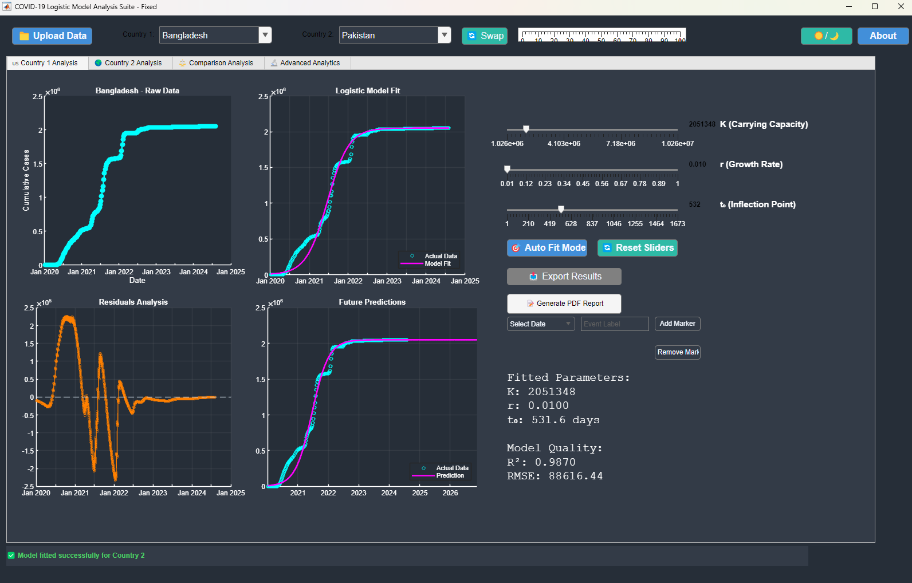
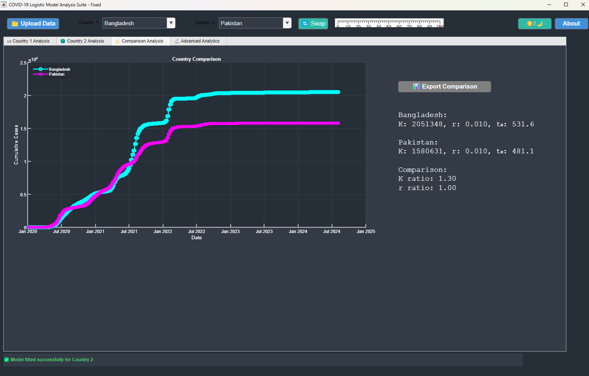
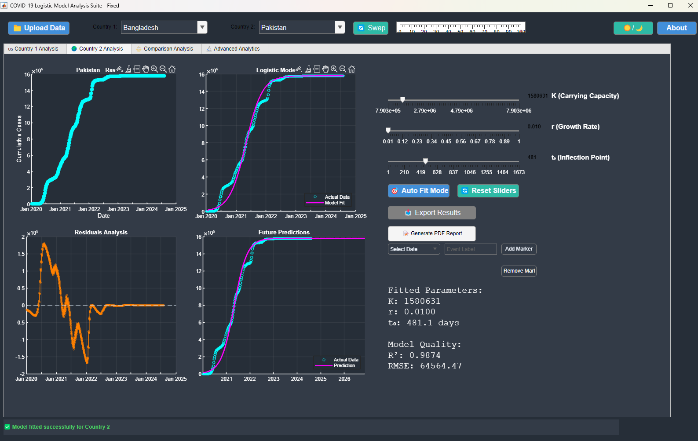
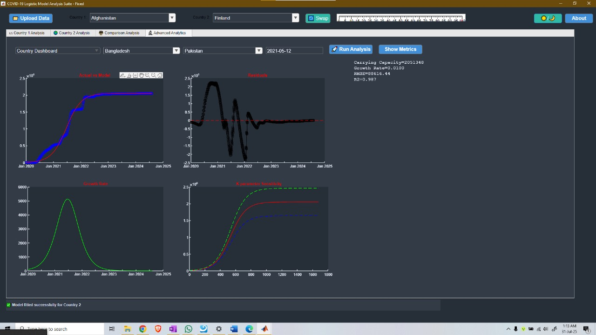
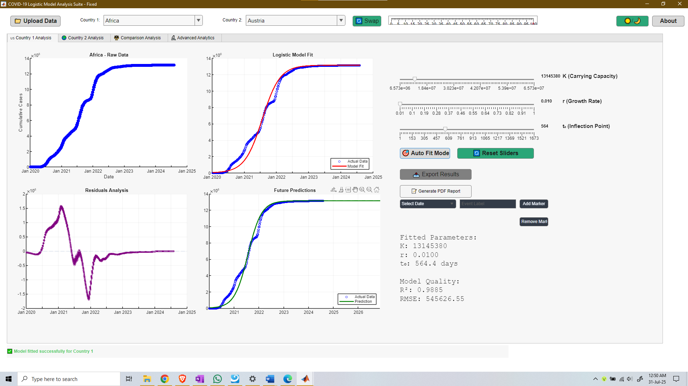
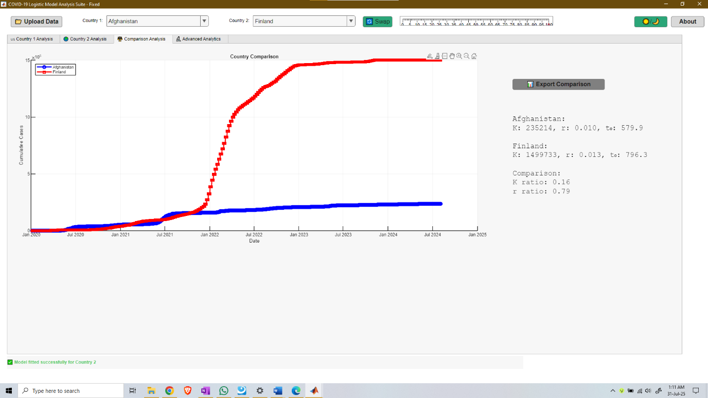
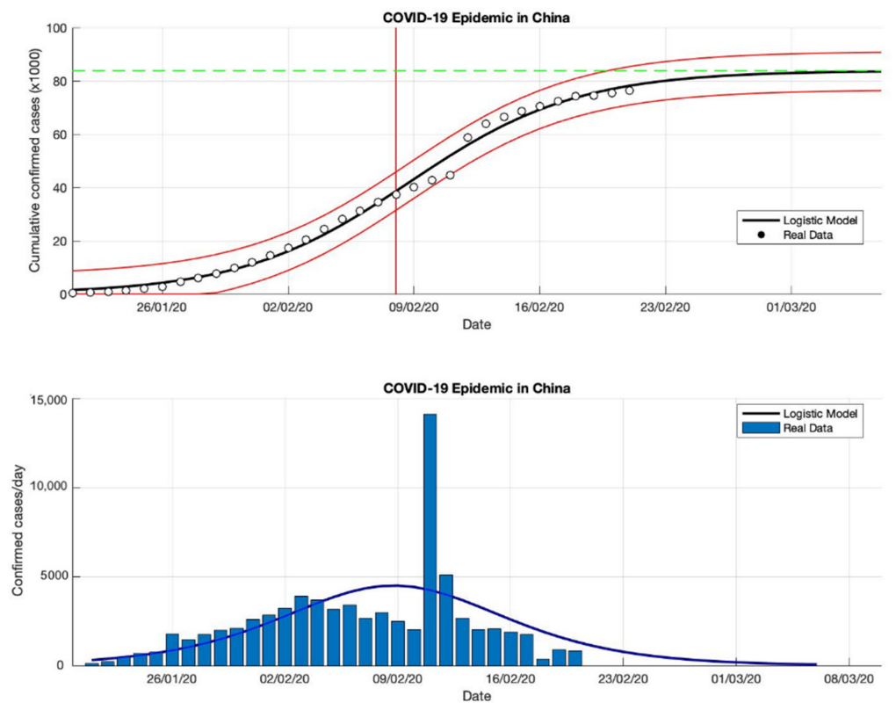

# Modeling the Spread of COVID-19 Using a Logistic Growth Model in MATLAB

[](https://www.mathworks.com/products/matlab.html)
[](LICENSE)
[](https://eee.buet.ac.bd/)
[](https://youtu.be/kMos3fnVl4Q)
[]()

> **BUET EEE 212: Numerical Technique Laboratory (January 2025 Semester)**  
> **Section**: C1 &nbsp;|&nbsp; **Group**: 06  
> **Project Presentation**: [Watch on YouTube (https://youtu.be/kMos3fnVl4Q)](https://youtu.be/kMos3fnVl4Q)

An interactive, research-grade MATLAB App Designer GUI suite and numerical optimization framework for modeling the cumulative spread of COVID-19. Utilizing real-world global epidemiology data from **Our World in Data (OWID)**, the platform estimates epidemiological parameters (carrying capacity $K$, intrinsic growth rate $r$, and inflection point $t_0$) through nonlinear least-squares curve fitting (`lsqcurvefit` / `fminsearch`), evaluates residual diagnostics, and predicts epidemic saturation points.

---

## 📸 Interactive GUI Showcase

### Dark Mode Analytics
| Bangladesh Single-Country Fit | Multi-Country Comparison |
| :---: | :---: |
|  |  |

| Pakistan Trajectory & Residuals | Advanced Analytics Dashboard |
| :---: | :---: |
|  |  |

### Light Mode Analytics
| Global Region Dashboard (Africa) | Dual Comparison Curve |
| :---: | :---: |
|  |  |

---

## ⚡ Key Features

- **Interactive MATLAB App Designer GUI (`COVID19_Logistic_GUI_App.m`)**:
  - **Dynamic Parameter Sliders**: Real-time interactive adjustment of Carrying Capacity ($K$), Growth Rate ($r$), and Inflection Point ($t_0$) with immediate visual feedback.
  - **Automated Optimization**: One-click nonlinear curve fitting using `lsqcurvefit` with automated initial guess estimation and bound constraints.
  - **Multi-Country Comparison**: Comparative overlay of any two nations with automated calculation of carrying capacity ratio ($K_1 / K_2$) and spread velocity ratio ($r_1 / r_2$).
  - **Residual & Error Diagnostics**: Multi-panel visualization of raw observations, model fits, residuals $(N_{\text{actual}} - N_{\text{predicted}})$, and future projections.
  - **Model Validation Metrics**: Real-time readout of Coefficient of Determination ($R^2$), Root Mean Square Error (RMSE), and Mean Absolute Error (MAE).
  - **Event Markers & Timelines**: Add custom event markers on epidemic timelines to study the impact of lockdowns, policy interventions, or vaccine rollouts.
  - **Automated Report Generation**: One-click PDF report export and CSV export of fitted parameters and predictions.
  - **Dynamic Theme Engine**: Modern UI with full support for seamless switching between **Dark Theme** and **Light Theme**.
- **Standalone Mathematical Modeling Pipeline (`phase2_model_estimate.m`)**:
  - Independent script for automated curve fitting, sensitivity analysis, and multi-panel publication-ready diagnostic plots.
- **Robust Data Preprocessing Pipeline (`loading_csv.m`)**:
  - Automated ingestion of large multi-country datasets, handling date parsing, monotonic cumulative filtering, and missing data interpolation.

---

## 📐 Mathematical Formulation

Epidemic case accumulation often follows an S-shaped (sigmoidal) trajectory characterized by three distinct phases:
1. **Exponential Expansion**: Rapid unchecked spread within a susceptible population.
2. **Deceleration (Inflection)**: Spread rates slow due to interventions, behavioral changes, or acquired immunity.
3. **Saturation (Plateau)**: Cumulative infections asymptotically approach the carrying capacity.

```
       Cumulative Cases N(t)
               ^
            K -|----------------------------------..- Saturation (Plateau)
               |                             _.-'
               |                         _.-'
          K/2 -|----------------------.-'             <-- Inflection Point (t0): Max Daily Cases
               |                  _.-'
               |              _.-'
               |         _..-'                        <-- Exponential Growth Phase
             0 +----------------------------------> Time (t)
```

### 1. Governing Differential Equation
The rate of change of cumulative infections $N(t)$ is governed by the continuous Verhulst logistic differential equation:

$$\frac{dN(t)}{dt} = r \cdot N(t) \cdot \left(1 - \frac{N(t)}{K}\right)$$

Where:
- $N(t)$: Cumulative number of confirmed cases at time $t$ (days).
- $K$: **Carrying Capacity** — the theoretical maximum cumulative cases under the prevailing environmental and policy regime.
- $r$: **Intrinsic Growth Rate** ($\text{day}^{-1}$) — determines how rapidly the outbreak accelerates.

### 2. Analytical Closed-Form Solution
Integrating the differential equation yields the three-parameter sigmoidal logistic model:

$$N(t) = \frac{K}{1 + \exp\left(-r \cdot (t - t_0)\right)}$$

Where:
- $t_0$: **Inflection Point (Peak Growth Time)** — the exact calendar date or day when daily new infections reach their absolute maximum:

$$\left(\frac{dN}{dt}\right)_{\text{max}} = \frac{r \cdot K}{4} \quad \text{at } t = t_0$$

### 3. Parameter Estimation via Nonlinear Least-Squares
Parameters $\boldsymbol{\theta} = [K, r, t_0]^T$ are estimated by solving the nonlinear least-squares optimization problem:

$$\min_{\boldsymbol{\theta}} \sum_{i=1}^{M} \left[ N_i - \frac{K}{1 + \exp\left(-r \cdot (t_i - t_0)\right)} \right]^2$$

Subject to the parameter bounds:
$$\max(N_{\text{obs}}) \le K \le 10 \cdot \max(N_{\text{obs}}), \quad 0.001 \le r \le 1.0, \quad 0 \le t_0 \le \max(t_{\text{obs}})$$

Solved in MATLAB using the Trust-Region-Reflective algorithm (`lsqcurvefit`) with Nelder-Mead simplex fallback (`fminsearch`).

### 4. Theoretical Sigmoidal Curve & Daily Rate


---

## 📂 Repository Structure

```text
├── .gitignore                          # MATLAB, OS, and large file exclusion rules
├── LICENSE                             # MIT Open-Source License
├── README.md                           # Project documentation and user guide
├── CITATION.cff                        # Academic citation metadata
├── Code/                               # MATLAB source code
│   ├── COVID19_Logistic_GUI_App.m      # Full App Designer interactive suite (>2,100 lines)
│   ├── loading_csv.m                   # Data extraction and preprocessing pipeline
│   └── phase2_model_estimate.m         # Mathematical modeling & optimization script
├── Data/                               # Datasets & benchmark files
│   ├── README.md                       # Data acquisition instructions & schema details
│   ├── owid-covid-data.zip             # Compressed OWID global dataset (10.6 MB)
│   └── bangladesh_covid_processed.csv  # Preprocessed Bangladesh benchmark data (39.6 KB)
├── Docs/                               # Project reports & presentation slides
│   ├── Presentation/
│   │   ├── Presentation on EEE 212.pdf
│   │   └── Presentation on EEE 212.pptx
│   └── Report/
│       ├── Final Project Report_EEE212.pdf
│       └── Final Project Report_EEE212.docx
└── assets/                             # High-resolution UI screenshots & diagrams
    ├── gui_dark_bangladesh.png
    ├── gui_dark_pakistan.png
    ├── gui_dark_comparison.png
    ├── gui_dark_advanced.jpg
    ├── gui_light_country1.png
    ├── gui_light_country2.png
    ├── gui_light_comparison.png
    ├── gui_light_advanced.png
    ├── logistic_curve_theory.png
    └── sigmoidal_curve.png
```

---

## 🚀 Getting Started

### Prerequisites
- **MATLAB** R2020b or later (tested on R2022b–R2024b).
- **Optimization Toolbox** (for `lsqcurvefit`, `optimoptions`).
- **Statistics and Machine Learning Toolbox** (for statistical metrics).

### Installation & Quick Start

1. **Clone the repository**:
   ```bash
   git clone https://github.com/sindidislam/COVID19-Logistic-Growth-MATLAB.git
   cd COVID19-Logistic-Growth-MATLAB
   ```

2. **Open MATLAB** and navigate to the project directory:
   ```matlab
   cd('Code')
   ```

3. **Run the Interactive GUI Application**:
   ```matlab
   app = COVID19_Logistic_GUI_App;
   ```
   - Click **Upload Data** and select `../Data/owid-covid-data.zip` (unzip if prompted) or `../Data/bangladesh_covid_processed.csv`.
   - Select **Country 1** and **Country 2** from the dropdown.
   - Use the interactive sliders or click **Auto Fit Mode** to run nonlinear curve fitting.
   - Toggle **Dark/Light Theme** using the top-right button.
   - Click **Generate PDF Report** or **Export Results** as needed.

4. **Run Standalone Model Estimation Script**:
   ```matlab
   phase2_model_estimate
   ```
   - Automatically loads benchmark Bangladesh COVID-19 data.
   - Fits the logistic growth model, calculates $R^2$ and RMSE, and displays a 4-panel diagnostic figure (Actual vs. Model, Residuals, Predicted Daily Growth, and Parameter Sensitivity).

---

## 📊 Benchmark Results (Bangladesh Case Study)

Applying the logistic growth model to the Bangladesh epidemic timeline yields:

| Metric / Parameter | Value | Interpretation |
| :--- | :---: | :--- |
| **Carrying Capacity ($K$)** | $\approx 2,051,348$ cases | Estimated cumulative saturation level |
| **Growth Rate ($r$)** | $0.0100\ \text{day}^{-1}$ | Intrinsic propagation speed |
| **Inflection Point ($t_0$)** | Day $531.6$ ($\approx$ Aug 2021) | Transition point from acceleration to deceleration |
| **Goodness of Fit ($R^2$)** | **$0.9870$** | Exceptional adherence to cumulative trajectory |
| **Root Mean Square Error (RMSE)** | $88,616.44$ | Residual variance over entire pandemic duration |

---

## 👥 Authors & Academic Credits

### Project Team (Group 06 — Section C1)
Department of Electrical and Electronic Engineering (EEE)  
**Bangladesh University of Engineering and Technology (BUET)**

| Full Name | Student ID | Contribution Focus |
| :--- | :---: | :--- |
| **S. M. Sindid Islam Mahodi** | `2206147` | Curve fitting algorithms, sensitivity analysis, optimization |
| **Sasshata Talukder** | `2206136` | GUI design, event marker module, data integration |
| **Rajib Khan** | `2206152` | Data cleaning, preprocessing, comparison metrics |
| **Iftekhar-E-Islam** | `2206153` | GUI theming, PDF export, performance reporting |

### Course Instructors
- **Shafin-Bin-Hamid** — Assistant Professor, Department of EEE, BUET
- **Anudwaipaon Antu** — Part-Time Lecturer, Department of EEE, BUET

### Course Details
- **Course Title**: Numerical Technique Laboratory
- **Course Code**: EEE 212
- **Academic Session**: January 2025

---

## 📺 Presentation Video

Watch our project presentation and live demo on YouTube:  
👉 **[Watch Final Presentation on YouTube](https://youtu.be/kMos3fnVl4Q)**

---

## 📄 License

This project is licensed under the **MIT License** — see the [LICENSE](LICENSE) file for details.

---

## 📖 Citation

If you use this software, dataset benchmarks, or methodology in academic research or coursework, please cite:

```bibtex
@software{buet_eee212_covid19_logistic,
  author       = {Mahodi, S. M. Sindid Islam and Talukder, Sasshata and Khan, Rajib and Iftekhar-E-Islam},
  title        = {Modeling the Spread of COVID-19 Using a Logistic Growth Model in MATLAB},
  year         = {2025},
  publisher    = {GitHub},
  journal      = {GitHub repository},
  howpublished = {\url{https://github.com/sindidislam/COVID19-Logistic-Growth-MATLAB}},
  note         = {BUET EEE 212 Numerical Technique Laboratory Final Project}
}
```
